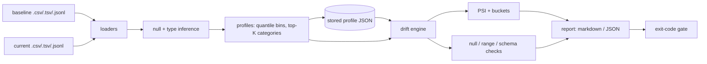

# colshift

[English](README.md) | [中文](README.zh.md) | [日本語](README.ja.md)

[](LICENSE) [](CHANGELOG.md) [](pyproject.toml)  [](CONTRIBUTING.md)

**データセットスナップショットの列ごとドリフトレポートをオープンソースで —— PSI・値域・null 率を、オフラインの 1 コマンドで 2 つの CSV から markdown/JSON の判定へ。**


```bash
git clone https://github.com/JaydenCJ/colshift && cd colshift && pip install -e .
```

> **プレリリース：** colshift はまだ PyPI に公開されていません。初回リリースまでは [JaydenCJ/colshift](https://github.com/JaydenCJ/colshift) をクローンし、リポジトリのルートで `pip install -e .` を実行してください。ランタイム依存ゼロなので、`PYTHONPATH=src python3 -m colshift` ならインストールなしでも動きます。

## なぜ colshift？

「モデルやダッシュボードの下でデータが変わっていないか？」は毎日の心配事なのに、既存の答えはどれも大げさです。監視プラットフォームは null 率が倍になったと知るためにサーバーとデータベースとダッシュボードを要求し、notebook ライブラリは pandas と plotly とカーネルを要求し、手書きスクリプトは PSI のビンの切り方をまた思い出させようとします。colshift はその欠けていた小さな道具です。オフラインの 1 コマンドで 2 つのスナップショット（CSV・TSV・JSONL）を読み、ベースライン分位点ビンでの列ごと PSI、null 率の変化、値域の拡張、スキーマ変更を計算し、人間向けの markdown レポートとパイプライン向けのバージョン付き JSON レポートを出力 —— 終了コードはそのまま CI のゲートになります。さらにベースラインをコンパクトな profile JSON として保存しコミットできます。profile との比較は生ファイルとの比較と一致することが保証されるので、生のベースラインデータを持ち回る必要はもうありません。

|  | colshift | Evidently | whylogs | Great Expectations | 手書き pandas |
|---|---|---|---|---|---|
| ドリフト確認 1 回のための導入 | 依存ゼロ CLI | numpy/pandas/plotly 一式 | pandas + sketching ホイール | フレームワーク一式 + 設定 | pandas + 自作の式 |
| オフライン動作、サーバーも notebook も不要 | はい | レポートにライブラリ一式が必要 | クラウド任意、ホイールは必要 | context と stores の準備 | はい |
| 生データ不要のコミット可能なベースライン | はい —— profile JSON | 参照データセットが必要 | はい —— バイナリ profile | 期待値であって分布ではない | まれ |
| バケットごとの寄与つき PSI | はい | PSI スコアのみ | 距離系メトリクス | なし | 自分で書く |
| markdown + JSON レポートと CI 終了コード | はい | HTML/JSON、ゲート CLI なし | constraints API | あるが重い | 場当たり的 |
| ランタイム依存 | 0 | ~20 | ~7 | ~30 | pandas とその仲間 |

<sub>依存数は 2026-07 時点で各パッケージが PyPI 上で宣言するランタイム依存（evidently 0.7、whylogs 1.6、great-expectations 1.5。概数）。colshift の数字は [pyproject.toml](pyproject.toml) の `dependencies = []` です。</sub>

## 特徴

- **根拠つきの PSI** —— 各列はベースライン分位点ビン上の Population Stability Index を持ち、各バケットが正確な寄与を報告するため、レポートは数字だけでなく分布の*どこ*が動いたかまで語ります。
- **null と値域は一級市民** —— null 率の変化には独自の閾値があり（列がこっそり 2% から 18% null になれば PSI が平穏でも alert）、ベースラインの min–max を超えた数値は値域拡張としてフラグされます。
- **スキーマドリフトも対象** —— 列の追加は warn、削除は alert、数値列がカテゴリ列に変われば alert、消えたカテゴリ値と確実に新しいカテゴリ値は名前つきで列挙されます。
- **コミットできるベースライン** —— `colshift profile` は集計値だけのコンパクトな JSON（分位点ビン、top-K カテゴリ、null 数。生の行は決して含まない）を書き出し、それとの比較は生ベースラインとの比較とビット単位で一致します。
- **設計から CI 対応** —— 終了コード 0/1/2 と `--fail-on never|warn|alert` ゲート、決定的でバイト単位に同一なレポート（キーはソート、タイムスタンプなし）、markdown は stdout へ、`--json-out` は成果物ストアへ。
- **境界でも正直** —— ベースラインに保存した top-K カテゴリが網羅的でない場合、未知の値は "(other)" の件数として報告され、新カテゴリだと偽って主張しません。空バケットの PSI 項は平滑化されますが、報告される割合は正確なままです。

## クイックスタート

インストールして小さなデモペアを生成します（実データ 2 つを指定しても構いません）：

```bash
git clone https://github.com/JaydenCJ/colshift && cd colshift && pip install -e .
python3 examples/make_snapshots.py demo
```

比較します —— current 側は `amount` がシフトし、`region` に新しい値が現れ、`income` の null 率が跳ね上がり、列が 1 つ入れ替わっています：

```bash
colshift compare demo/baseline.csv demo/current.csv --exclude loan_id
```

出力（実際の実行から転記、`...` で省略）：

```text
# colshift drift report

| Snapshot | Source | Rows | Columns |
|---|---|---:|---:|
| baseline | `demo/baseline.csv` | 400 | 8 |
| current | `demo/current.csv` | 450 | 8 |

**Verdict: ALERT** — 3 alert, 2 warn, 2 ok across 7 compared columns.

## Summary

| Column | Type | PSI | Nulls (base -> cur) | Verdict | Notes |
|---|---|---:|---|---|---|
| amount | numeric | 0.490 | 0.0% -> 0.0% | ALERT | range widened high: max 41,454.92 -> 69,139.63 |
| interest_rate | numeric | 0.234 | 0.0% -> 0.0% | WARN | range widened high: max 10.59 -> 11.78 |
| term_months | numeric | 0.022 | 0.0% -> 0.0% | OK | — |
| region | categorical | 0.357 | 0.0% -> 0.0% | ALERT | new categories: offshore (15) |
| channel | categorical | 0.007 | 0.0% -> 0.0% | OK | — |
| income | numeric | 0.055 | 2.0% -> 17.8% | ALERT | null rate 2.0% -> 17.8% |
| credit_score | numeric | 0.237 | 0.0% -> 0.0% | WARN | range widened low: min 543 -> 370 |

## Schema changes

- added in current: `device` (categorical)
- removed from baseline: `promo_code` (categorical)

## Column details

### amount — ALERT

- PSI 0.490 · nulls 0.0% -> 0.0% · range 1,541.54 – 41,454.92 -> 3,351.95 – 69,139.63
...
| > 18,459.924 | 40 (10.0%) | 130 (28.9%) | 0.200 |
...
```

終了コードは 1（alert レベルのドリフト）なので、同じコマンドがそのまま CI ゲートです。commit-a-profile ワークフローでは、ベースラインを一度スナップショットし、以後は新しいデータを常にそれと比較します：

```bash
colshift profile demo/baseline.csv -o baseline-profile.json
colshift compare baseline-profile.json demo/current.csv --exclude loan_id --json-out drift.json
```

`--format json` は完全なバージョン付き `colshift-report/1` ドキュメントを出力します。全体のウォークスルーは [`examples/drift_demo.sh`](examples/drift_demo.sh)、2 つの JSON 形式の仕様は [`docs/formats.md`](docs/formats.md) にあります。

## 判定レベル

各列は `ok` / `warn` / `alert` に分類され、レポートの判定はその最大値、`--fail-on` がそれを終了コードに変換します（デフォルトゲート：`alert`）。

| シグナル | Warn | Alert |
|---|---|---|
| PSI | ≥ 0.10 | ≥ 0.25 |
| null 率の変化（絶対値） | ≥ 5pp | ≥ 15pp |
| 数値の値域 | ベースラインの min/max を超過 | — |
| カテゴリ | 新しい値の出現・既存値の消失 | — |
| 列の型変更 | — | 常に alert |
| スキーマ | 列の追加 | 列の削除 |

## コマンドと主要オプション

| コマンド | 目的 | 終了コード |
|---|---|---|
| `colshift compare BASELINE CURRENT` | ドリフトレポート。BASELINE は生データでも保存済み profile でも可 | 0 ゲート未満、1 ゲート到達、2 エラー |
| `colshift profile INPUT [-o F]` | 集計値のみでコミット可能なベースライン profile | 0、2 エラー |

| キー | デフォルト | 効果 |
|---|---|---|
| `--bins N` | 10 | 数値 PSI の分位点バケット数（ベースラインが profile ならその設定を継承） |
| `--top-k N` | 20 | カテゴリ列ごとに保存するカテゴリ数。残りは `(other)` へ |
| `--psi-warn` / `--psi-alert` | 0.10 / 0.25 | PSI の閾値 |
| `--null-warn` / `--null-alert` | 0.05 / 0.15 | null 率変化の絶対閾値 |
| `--fail-on LEVEL` | `alert` | `never` / `warn` / `alert` の終了コードゲート |
| `--columns` / `--exclude` | — | 比較対象の限定（id 系の列を除外する） |
| `--format` / `--out` / `--json-out` | markdown を stdout へ | レポート形式と出力先 |
| `--null-tokens A,B` | `NULL`・`NaN`・`NA` など | null トークン集合の置き換え（空セルは常に null） |

## 検証

このリポジトリは CI を一切同梱しません。上記の主張はすべてローカル実行で検証されています。このリポジトリのチェックアウトから再現できます：

```bash
pip install -e '.[dev]' && pytest && bash scripts/smoke.sh
```

出力（実際の実行から転記、`...` で省略）：

```text
92 passed in 0.57s
...
[compare] **Verdict: ALERT** — 3 alert, 2 warn, 2 ok across 7 compared columns.
...
SMOKE OK
```

## アーキテクチャ



## ロードマップ

- [x] CSV/TSV/JSONL ローダー、型推論、寄与つき分位点ビン PSI、null/値域/スキーマ検査、コミット可能な profile、markdown+JSON レポート、CI ゲート（v0.1.0）
- [ ] PyPI への公開（`pip install colshift`）
- [ ] オプション extra としての Parquet 入力（コアは依存ゼロのまま）
- [ ] 設定ファイルによる列ごとの閾値上書き
- [ ] 合格した実行後に profile を前へ進める `--update-baseline` モード
- [ ] ターミナル外で共有するための HTML レポートレンダラー

全リストは [open issues](https://github.com/JaydenCJ/colshift/issues) を参照してください。

## コントリビュート

コントリビュートを歓迎します —— まずは [good first issue](https://github.com/JaydenCJ/colshift/issues?q=is%3Aissue+is%3Aopen+label%3A%22good+first+issue%22) から始めるか、[discussion](https://github.com/JaydenCJ/colshift/discussions) を立ててください。開発環境の構築は [CONTRIBUTING.md](CONTRIBUTING.md) にあります。

## ライセンス

[MIT](LICENSE)
