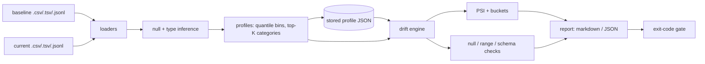

# colshift

[English](README.md) | [中文](README.zh.md) | [日本語](README.ja.md)

[](LICENSE) [](CHANGELOG.md) [](pyproject.toml)  [](CONTRIBUTING.md)

**Open-source per-column drift reports for dataset snapshots — PSI, ranges and null rates, from two CSVs to a markdown/JSON verdict in one offline command.**


```bash
git clone https://github.com/JaydenCJ/colshift && cd colshift && pip install -e .
```

> **Pre-release:** colshift is not yet published to PyPI. Until the first release, clone [JaydenCJ/colshift](https://github.com/JaydenCJ/colshift) and run `pip install -e .` from the repository root. The tool has zero runtime dependencies, so `PYTHONPATH=src python3 -m colshift` works without installing anything.

## Why colshift?

"Did the data change under my model or dashboard?" is a daily worry, and the standard answers are all oversized: monitoring platforms want a server, a database and a dashboard to tell you that a null rate doubled; notebook libraries want pandas, plotly and a kernel; and the hand-rolled script wants you to remember, again, how PSI bins are supposed to be cut. colshift is the missing small tool: a single offline command that reads two snapshots (CSV, TSV, or JSONL), computes per-column PSI over baseline-quantile buckets, null-rate deltas, range expansion and schema changes, and emits a markdown report for humans plus a versioned JSON report for pipelines — with an exit code you can gate CI on. Store a baseline as a compact profile JSON and commit it: comparisons against the profile are guaranteed to match comparisons against the raw file, so the raw baseline never needs to travel.

|  | colshift | Evidently | whylogs | Great Expectations | hand-rolled pandas |
|---|---|---|---|---|---|
| Install for one drift check | zero-dep CLI | numpy/pandas/plotly stack | pandas + sketching wheels | full framework + config | pandas + your formulas |
| Runs offline, no server or notebook | Yes | report needs the library stack | cloud-optional, wheels required | context + stores setup | Yes |
| Committable baseline without raw data | Yes — profile JSON | reference dataset needed | Yes — binary profiles | expectations, not distributions | rarely |
| PSI with per-bucket contributions | Yes | PSI score only | distance metrics | No | you write it |
| Markdown + JSON reports, CI exit code | Yes | HTML/JSON, no gate CLI | constraints API | Yes, heavyweight | ad hoc |
| Runtime dependencies | 0 | ~20 | ~7 | ~30 | pandas + friends |

<sub>Dependency counts are the declared runtime requirements on PyPI as of 2026-07 (evidently 0.7, whylogs 1.6, great-expectations 1.5; counts rounded). colshift's count is `dependencies = []` in [pyproject.toml](pyproject.toml).</sub>

## Features

- **PSI with receipts** — every column gets a Population Stability Index over baseline-quantile buckets, and every bucket reports its exact contribution, so the report says *which* part of the distribution moved, not just a number.
- **Nulls and ranges are first-class** — null-rate deltas have their own thresholds (a column silently going 2% → 18% null is an alert even when PSI is calm), and numeric values escaping the baseline min–max are flagged as range expansion.
- **Schema drift included** — added columns warn, removed columns alert, a numeric column turning categorical alerts, and vanished or genuinely new category values are listed by name.
- **Baselines you can commit** — `colshift profile` writes a compact aggregate-only JSON (quantile bins, top-K categories, null counts; never raw rows); comparing against it is bit-identical to comparing against the raw baseline.
- **CI-ready by construction** — exit 0/1/2 with a `--fail-on never|warn|alert` gate, deterministic byte-identical reports (sorted keys, no timestamps), markdown to stdout and `--json-out` for the artifact store.
- **Honest at the edges** — when the baseline's stored top-K categories were not exhaustive, unseen values are reported as an "(other)" count instead of being falsely claimed as new; empty-bucket PSI terms are smoothed but reported shares stay exact.

## Quickstart

Install, then generate a small demo pair (or point it at two real snapshots):

```bash
git clone https://github.com/JaydenCJ/colshift && cd colshift && pip install -e .
python3 examples/make_snapshots.py demo
```

Compare them — the current snapshot has a shifted `amount`, a new `region` value, an `income` null-rate jump, and one column swapped out:

```bash
colshift compare demo/baseline.csv demo/current.csv --exclude loan_id
```

Output (copied from a real run, truncated with `...`):

```text
# colshift drift report

| Snapshot | Source | Rows | Columns |
|---|---|---:|---:|
| baseline | `demo/baseline.csv` | 400 | 8 |
| current | `demo/current.csv` | 450 | 8 |

**Verdict: ALERT** — 3 alert, 2 warn, 2 ok across 7 compared columns.

## Summary

| Column | Type | PSI | Nulls (base -> cur) | Verdict | Notes |
|---|---|---:|---|---|---|
| amount | numeric | 0.490 | 0.0% -> 0.0% | ALERT | range widened high: max 41,454.92 -> 69,139.63 |
| interest_rate | numeric | 0.234 | 0.0% -> 0.0% | WARN | range widened high: max 10.59 -> 11.78 |
| term_months | numeric | 0.022 | 0.0% -> 0.0% | OK | — |
| region | categorical | 0.357 | 0.0% -> 0.0% | ALERT | new categories: offshore (15) |
| channel | categorical | 0.007 | 0.0% -> 0.0% | OK | — |
| income | numeric | 0.055 | 2.0% -> 17.8% | ALERT | null rate 2.0% -> 17.8% |
| credit_score | numeric | 0.237 | 0.0% -> 0.0% | WARN | range widened low: min 543 -> 370 |

## Schema changes

- added in current: `device` (categorical)
- removed from baseline: `promo_code` (categorical)

## Column details

### amount — ALERT

- PSI 0.490 · nulls 0.0% -> 0.0% · range 1,541.54 – 41,454.92 -> 3,351.95 – 69,139.63
...
| > 18,459.924 | 40 (10.0%) | 130 (28.9%) | 0.200 |
...
```

The exit code is 1 (drift at alert level), so the same command is the CI gate. For the commit-a-profile workflow, snapshot the baseline once and compare fresh data against it forever:

```bash
colshift profile demo/baseline.csv -o baseline-profile.json
colshift compare baseline-profile.json demo/current.csv --exclude loan_id --json-out drift.json
```

`--format json` emits the complete versioned `colshift-report/1` document; the full walkthrough is [`examples/drift_demo.sh`](examples/drift_demo.sh), and both JSON formats are specified in [`docs/formats.md`](docs/formats.md).

## Verdicts

Each column is classified `ok` / `warn` / `alert`; the report verdict is the maximum, and `--fail-on` turns it into an exit code (default gate: `alert`).

| Signal | Warn | Alert |
|---|---|---|
| PSI | ≥ 0.10 | ≥ 0.25 |
| Null-rate delta (absolute) | ≥ 5pp | ≥ 15pp |
| Numeric range | expanded beyond baseline min/max | — |
| Categories | new or missing category values | — |
| Column type changed | — | always |
| Schema | column added | column removed |

## Commands and key options

| Command | Purpose | Exit codes |
|---|---|---|
| `colshift compare BASELINE CURRENT` | drift report; BASELINE may be raw data or a stored profile | 0 below gate, 1 drift at gate, 2 error |
| `colshift profile INPUT [-o F]` | committable aggregate-only baseline profile | 0, 2 error |

| Key | Default | Effect |
|---|---|---|
| `--bins N` | 10 | quantile buckets for numeric PSI (from the profile when the baseline is one) |
| `--top-k N` | 20 | categories stored per categorical column; the tail becomes `(other)` |
| `--psi-warn` / `--psi-alert` | 0.10 / 0.25 | PSI thresholds |
| `--null-warn` / `--null-alert` | 0.05 / 0.15 | absolute null-rate delta thresholds |
| `--fail-on LEVEL` | `alert` | `never` / `warn` / `alert` exit-code gate |
| `--columns` / `--exclude` | — | restrict the comparison (exclude id-like columns) |
| `--format` / `--out` / `--json-out` | markdown to stdout | report format and destinations |
| `--null-tokens A,B` | `NULL`, `NaN`, `NA`, … | replace the null-token set (empty cells are always null) |

## Verification

This repository ships no CI; every claim above is verified by local runs. Reproduce them from a checkout of this repository:

```bash
pip install -e '.[dev]' && pytest && bash scripts/smoke.sh
```

Output (copied from a real run, truncated with `...`):

```text
92 passed in 0.57s
...
[compare] **Verdict: ALERT** — 3 alert, 2 warn, 2 ok across 7 compared columns.
...
SMOKE OK
```

## Architecture



## Roadmap

- [x] CSV/TSV/JSONL loaders, type inference, quantile-bin PSI with contributions, null/range/schema checks, committable profiles, markdown+JSON reports, CI gate (v0.1.0)
- [ ] PyPI release with `pip install colshift`
- [ ] Parquet input behind an optional extra (the core stays zero-dep)
- [ ] Per-column threshold overrides via a config file
- [ ] `--update-baseline` mode that rolls the profile forward after a passing run
- [ ] HTML report renderer for sharing outside the terminal

See the [open issues](https://github.com/JaydenCJ/colshift/issues) for the full list.

## Contributing

Contributions are welcome — start with a [good first issue](https://github.com/JaydenCJ/colshift/issues?q=is%3Aissue+is%3Aopen+label%3A%22good+first+issue%22) or open a [discussion](https://github.com/JaydenCJ/colshift/discussions). See [CONTRIBUTING.md](CONTRIBUTING.md) for the development setup.

## License

[MIT](LICENSE)
