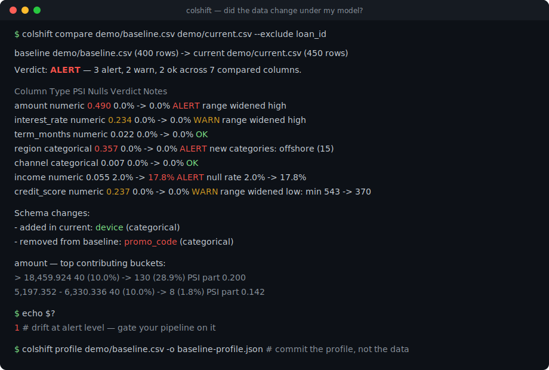
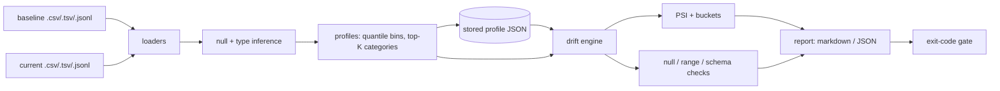

# colshift

[English](README.md) | [中文](README.zh.md) | [日本語](README.ja.md)

[](LICENSE) [](CHANGELOG.md) [](pyproject.toml)  [](CONTRIBUTING.md)

**开源的数据集快照逐列漂移报告 —— PSI、取值范围与空值率，一条离线命令把两个 CSV 变成 markdown/JSON 结论。**



```bash
git clone https://github.com/JaydenCJ/colshift && cd colshift && pip install -e .
```

> **预发布：** colshift 尚未发布到 PyPI。首个正式版之前，请克隆 [JaydenCJ/colshift](https://github.com/JaydenCJ/colshift) 并在仓库根目录执行 `pip install -e .`。工具零运行时依赖，`PYTHONPATH=src python3 -m colshift` 无需安装即可运行。

## 为什么是 colshift？

“我的模型或看板底下的数据变了吗？”是每天都在发生的担忧，而现成的答案全都过于庞大：监控平台要架服务器、数据库和看板才能告诉你空值率翻倍了；notebook 库要 pandas、plotly 和一个内核；手写脚本则要你再一次回忆 PSI 分桶到底该怎么切。colshift 补上了缺失的那个小工具：一条离线命令读入两个快照（CSV、TSV 或 JSONL），基于基线分位数分桶逐列计算 PSI、空值率变化、范围扩张与 schema 变更，同时输出给人看的 markdown 报告和给流水线用的版本化 JSON 报告 —— 退出码可直接作为 CI 门禁。还可以把基线存成一份紧凑的 profile JSON 提交进版本库：对 profile 的比较保证与对原始文件的比较结果一致，原始基线数据从此不必再流转。

|  | colshift | Evidently | whylogs | Great Expectations | 手写 pandas |
|---|---|---|---|---|---|
| 做一次漂移检查的安装成本 | 零依赖 CLI | numpy/pandas/plotly 全家桶 | pandas + sketching 轮子 | 完整框架 + 配置 | pandas + 自己的公式 |
| 离线运行，无需服务器或 notebook | 是 | 报告依赖整套库 | 云可选，仍需轮子 | 需要 context 与 stores | 是 |
| 无需原始数据的可提交基线 | 是 —— profile JSON | 需要参照数据集 | 是 —— 二进制 profile | 是期望而非分布 | 很少 |
| 带逐桶贡献的 PSI | 是 | 只有 PSI 分数 | 距离类指标 | 无 | 自己实现 |
| markdown + JSON 报告与 CI 退出码 | 是 | HTML/JSON，无门禁 CLI | constraints API | 有但很重 | 临时拼凑 |
| 运行时依赖 | 0 | ~20 | ~7 | ~30 | pandas 及其朋友们 |

<sub>依赖数为 2026-07 时各包在 PyPI 上声明的运行时依赖（evidently 0.7、whylogs 1.6、great-expectations 1.5；取整）。colshift 的数字即 [pyproject.toml](pyproject.toml) 中的 `dependencies = []`。</sub>

## 特性

- **有凭有据的 PSI** —— 每一列都在基线分位数分桶上计算 Population Stability Index，每个桶都报告自己的精确贡献，报告因此能说清分布*哪一段*动了，而不只是给个数字。
- **空值与范围是一等公民** —— 空值率变化有独立阈值（某列悄悄从 2% 变到 18% 空值，即使 PSI 风平浪静也是 alert），数值越出基线 min–max 会被标记为范围扩张。
- **schema 漂移也在内** —— 新增列 warn，删除列 alert，数值列变成分类列 alert，消失的和确凿新增的类别值都按名字列出。
- **可提交的基线** —— `colshift profile` 写出仅含聚合量的紧凑 JSON（分位数分桶、top-K 类别、空值计数；绝不含原始行）；对它比较与对原始基线比较逐位一致。
- **天生适配 CI** —— 退出码 0/1/2 加 `--fail-on never|warn|alert` 门禁，报告确定性逐字节一致（键排序、无时间戳），markdown 走 stdout，`--json-out` 存制品库。
- **边界处保持诚实** —— 基线存储的 top-K 类别不完备时，未见过的值按 "(other)" 计数报告而不会被谎称为新类别；空桶的 PSI 项做平滑但报告中的占比保持精确。

## 快速上手

安装后生成一对小演示快照（或直接指向两个真实快照）：

```bash
git clone https://github.com/JaydenCJ/colshift && cd colshift && pip install -e .
python3 examples/make_snapshots.py demo
```

比较它们 —— current 快照的 `amount` 整体偏移、`region` 出现新值、`income` 空值率跳升，还换掉了一列：

```bash
colshift compare demo/baseline.csv demo/current.csv --exclude loan_id
```

输出（摘自真实运行，用 `...` 截断）：

```text
# colshift drift report

| Snapshot | Source | Rows | Columns |
|---|---|---:|---:|
| baseline | `demo/baseline.csv` | 400 | 8 |
| current | `demo/current.csv` | 450 | 8 |

**Verdict: ALERT** — 3 alert, 2 warn, 2 ok across 7 compared columns.

## Summary

| Column | Type | PSI | Nulls (base -> cur) | Verdict | Notes |
|---|---|---:|---|---|---|
| amount | numeric | 0.490 | 0.0% -> 0.0% | ALERT | range widened high: max 41,454.92 -> 69,139.63 |
| interest_rate | numeric | 0.234 | 0.0% -> 0.0% | WARN | range widened high: max 10.59 -> 11.78 |
| term_months | numeric | 0.022 | 0.0% -> 0.0% | OK | — |
| region | categorical | 0.357 | 0.0% -> 0.0% | ALERT | new categories: offshore (15) |
| channel | categorical | 0.007 | 0.0% -> 0.0% | OK | — |
| income | numeric | 0.055 | 2.0% -> 17.8% | ALERT | null rate 2.0% -> 17.8% |
| credit_score | numeric | 0.237 | 0.0% -> 0.0% | WARN | range widened low: min 543 -> 370 |

## Schema changes

- added in current: `device` (categorical)
- removed from baseline: `promo_code` (categorical)

## Column details

### amount — ALERT

- PSI 0.490 · nulls 0.0% -> 0.0% · range 1,541.54 – 41,454.92 -> 3,351.95 – 69,139.63
...
| > 18,459.924 | 40 (10.0%) | 130 (28.9%) | 0.200 |
...
```

退出码为 1（漂移达到 alert 级别），同一条命令即是 CI 门禁。commit-a-profile 工作流：对基线做一次快照，之后新数据永远与它比较：

```bash
colshift profile demo/baseline.csv -o baseline-profile.json
colshift compare baseline-profile.json demo/current.csv --exclude loan_id --json-out drift.json
```

`--format json` 输出完整的版本化 `colshift-report/1` 文档；完整演练见 [`examples/drift_demo.sh`](examples/drift_demo.sh)，两种 JSON 格式的规格见 [`docs/formats.md`](docs/formats.md)。

## 结论级别

每列被判为 `ok` / `warn` / `alert`；报告结论取最大值，`--fail-on` 把它变成退出码（默认门禁：`alert`）。

| 信号 | Warn | Alert |
|---|---|---|
| PSI | ≥ 0.10 | ≥ 0.25 |
| 空值率变化（绝对值） | ≥ 5pp | ≥ 15pp |
| 数值范围 | 越出基线 min/max | — |
| 类别 | 出现新值或有值消失 | — |
| 列类型改变 | — | 一律 alert |
| Schema | 新增列 | 删除列 |

## 命令与关键选项

| 命令 | 用途 | 退出码 |
|---|---|---|
| `colshift compare BASELINE CURRENT` | 漂移报告；BASELINE 可以是原始数据或已存 profile | 0 未达门禁，1 漂移达门禁，2 错误 |
| `colshift profile INPUT [-o F]` | 仅含聚合量、可提交的基线 profile | 0，2 错误 |

| 选项 | 默认值 | 作用 |
|---|---|---|
| `--bins N` | 10 | 数值 PSI 的分位数桶数（基线为 profile 时沿用其设置） |
| `--top-k N` | 20 | 每个分类列存储的类别数；尾部归入 `(other)` |
| `--psi-warn` / `--psi-alert` | 0.10 / 0.25 | PSI 阈值 |
| `--null-warn` / `--null-alert` | 0.05 / 0.15 | 空值率变化的绝对阈值 |
| `--fail-on LEVEL` | `alert` | `never` / `warn` / `alert` 退出码门禁 |
| `--columns` / `--exclude` | — | 限定比较范围（把 id 类列排除掉） |
| `--format` / `--out` / `--json-out` | markdown 到 stdout | 报告格式与输出位置 |
| `--null-tokens A,B` | `NULL`、`NaN`、`NA` 等 | 替换空值 token 集合（空单元格永远算空值） |

## 验证

本仓库不带任何 CI；以上所有断言都由本地运行验证。从本仓库的检出即可复现：

```bash
pip install -e '.[dev]' && pytest && bash scripts/smoke.sh
```

输出（摘自真实运行，用 `...` 截断）：

```text
92 passed in 0.57s
...
[compare] **Verdict: ALERT** — 3 alert, 2 warn, 2 ok across 7 compared columns.
...
SMOKE OK
```

## 架构



## 路线图

- [x] CSV/TSV/JSONL 加载器、类型推断、带贡献的分位数分桶 PSI、空值/范围/schema 检查、可提交 profile、markdown+JSON 报告、CI 门禁（v0.1.0）
- [ ] 发布到 PyPI，支持 `pip install colshift`
- [ ] 以可选 extra 支持 Parquet 输入（核心保持零依赖）
- [ ] 通过配置文件按列覆盖阈值
- [ ] `--update-baseline` 模式：运行通过后向前滚动 profile
- [ ] HTML 报告渲染器，便于在终端之外分享

完整列表见 [open issues](https://github.com/JaydenCJ/colshift/issues)。

## 贡献

欢迎贡献 —— 可以从 [good first issue](https://github.com/JaydenCJ/colshift/issues?q=is%3Aissue+is%3Aopen+label%3A%22good+first+issue%22) 入手，或发起一个 [discussion](https://github.com/JaydenCJ/colshift/discussions)。开发环境搭建见 [CONTRIBUTING.md](CONTRIBUTING.md)。

## 许可证

[MIT](LICENSE)
